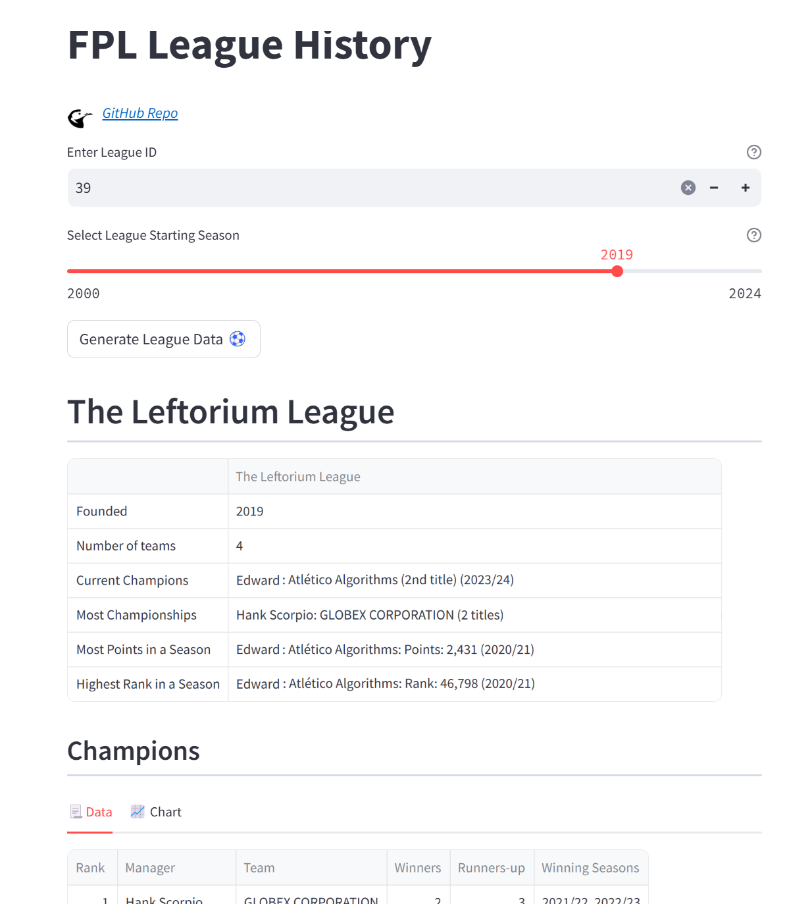

# FPL Tool | League History

### Overview
This create some key summary tables for historic league seasons.

Note that this is based on the current teams in a league in the current season, and their performance in previous seasons. 

### Hosted Dashboard Location
https://fpl.farragher.uk/


### Local Instructions
Python Version: 3.11.7

Clone this repo:
```
git clone https://github.com/edward-farragher/fpl-league-history.git
cd ff-complementing-fixtures
```

Install requirements (in virtual environment):
```
pip install -r requirements.txt
```

Run the Streamlit app:
```
streamlit run streamlit_app.py
```

Run the Dash app:
```
python dash_app.py
```

Navigate to local host: http://127.0.0.1:8050/.


## Dashboard Preview

### Streamlit


### Dash

