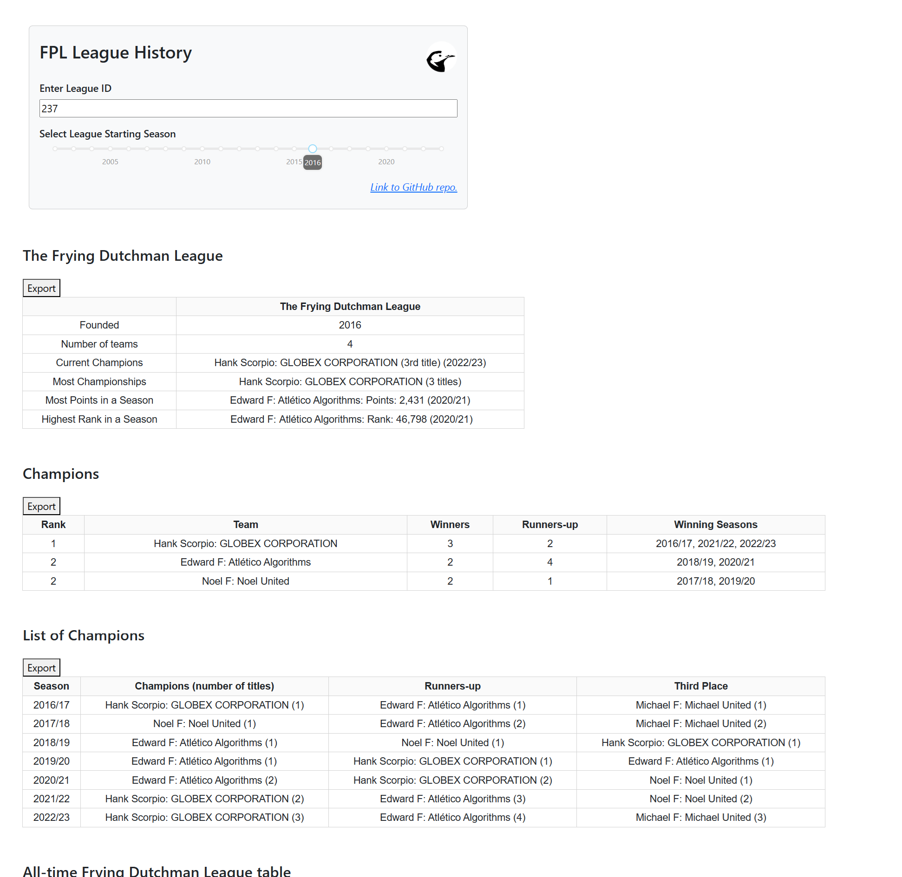

# FPL Tool | League History

### Overview
This create some key summary tables for historic league seasons.

Note that this is based on the current teams in a league in the current season, and their performance in previous seasons. 

### Hosted Dashboard Location
https://fpl-league-history.streamlit.app/


### Local Instructions
Python Version: 3.11.7

Clone this repo and install requirements (in virtual environment)

Run the Streamlit app:
```
streamlit run streamlit_app.py
```

Run the Dash app:
```
python dash_app.py
```

Navigate to local host: http://127.0.0.1:8050/.


## Dashboard Preview

### Streamlit


### Dash

